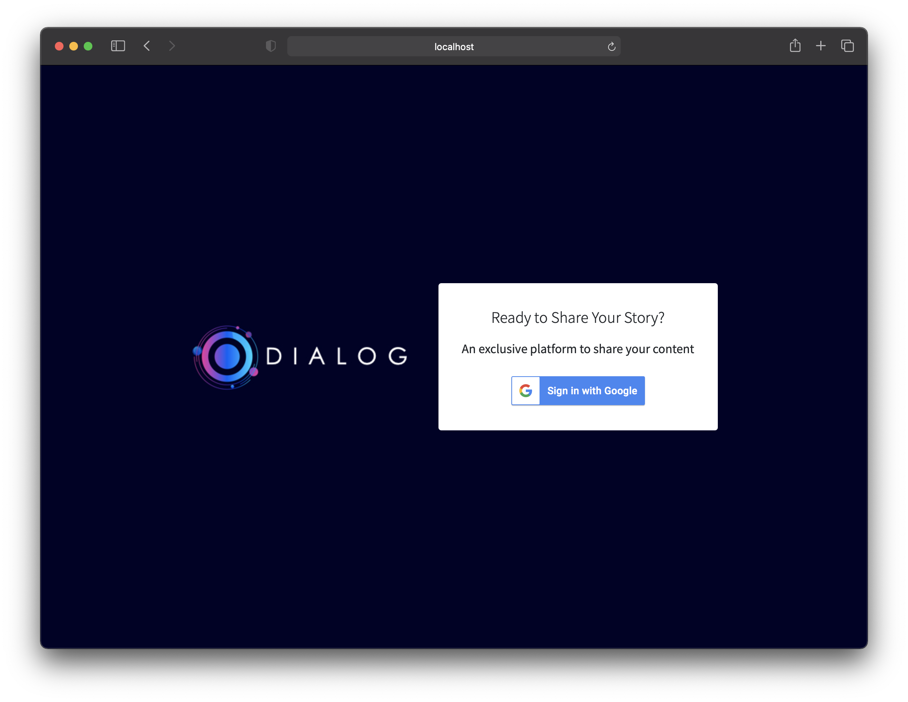

# Dialog

A Node JS project inspired by Traversy Media. Dialog is a private online community that allows users to publish their ideas, thoughts, and stories. This project utilizes MongoDB Atlas and Google user authentication.

[View Live Example](https://dialog-project.herokuapp.com/)

## 🚀 Quick start

1.  **Project Setup**

    Clone the project and install the dependencies

    ```shell
    git clone https://github.com/davidkim10/dialog-app
    cd dialog-app
    npm install
    ```

2.  **Run Project**

    ```shell
    npm start
    ```

    View app on `http://localhost:3000`

## 📷 Screenshots



## ⁉️ Frequently Asked Questions

- **What is ReactJS**

  React is an open-source, front end, JavaScript library for building user interfaces or UI components.
  <a href="https://reactjs.org/" target="_blank">Learn More</a>

- **What is MongoDB?**

  MongoDB is a cross-platform document-oriented database program. Classified as a NoSQL database program, MongoDB uses JSON-like documents with optional schemas. <a href="https://www.mongodb.com/" target="_blank">Learn More</a>
