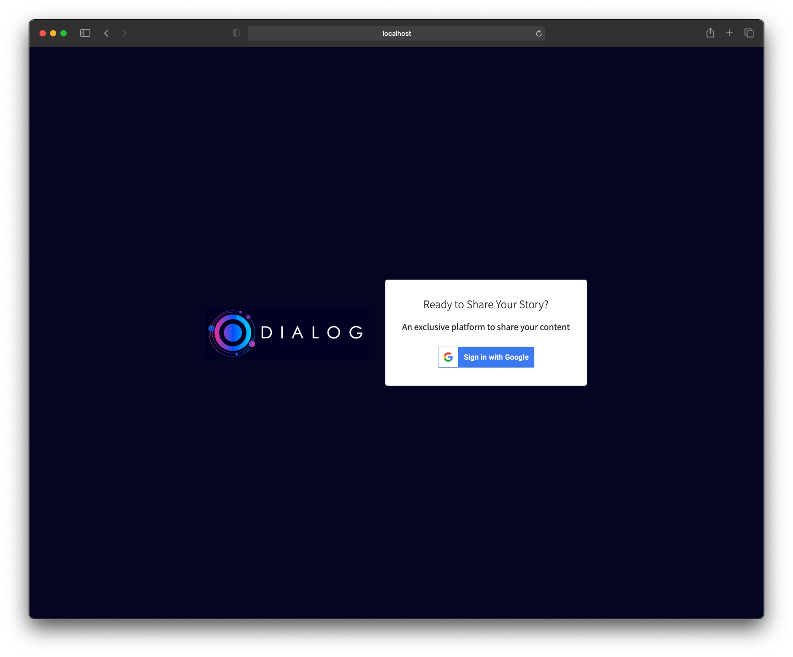
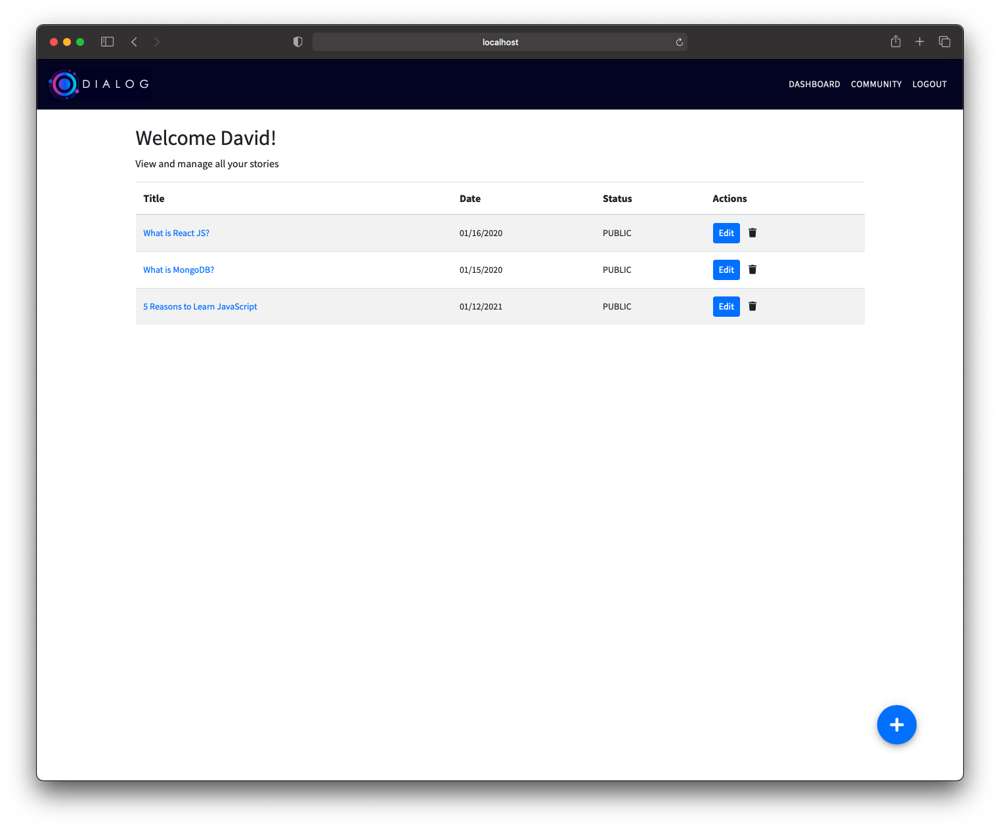
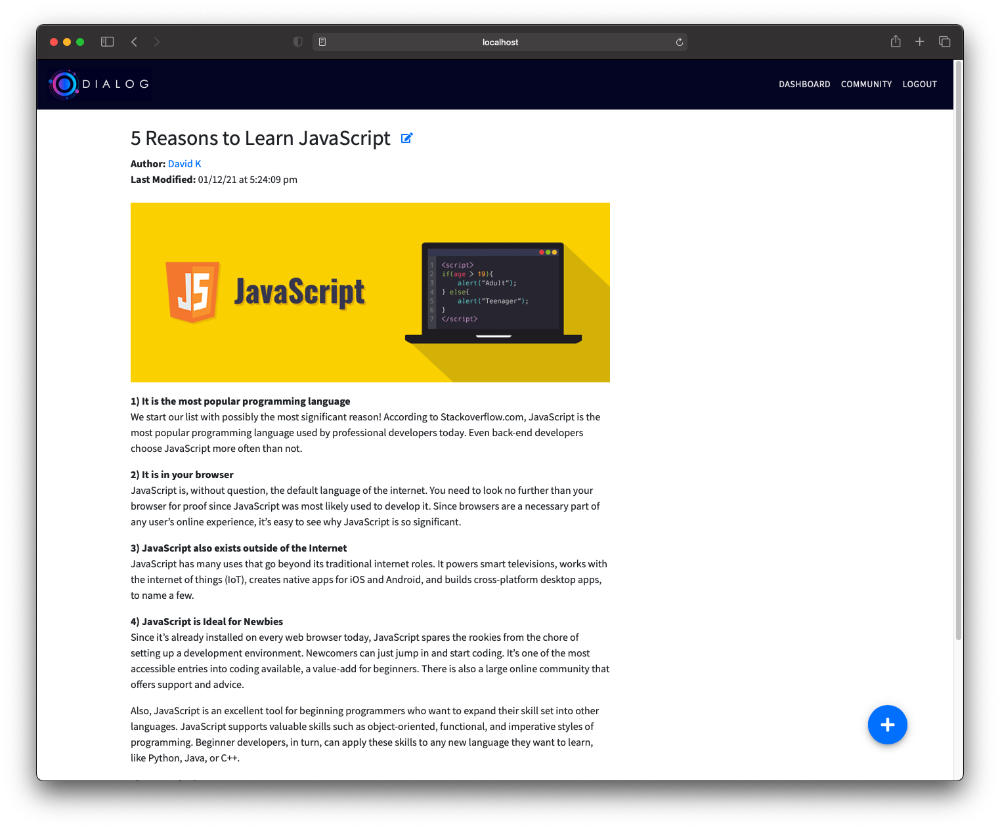
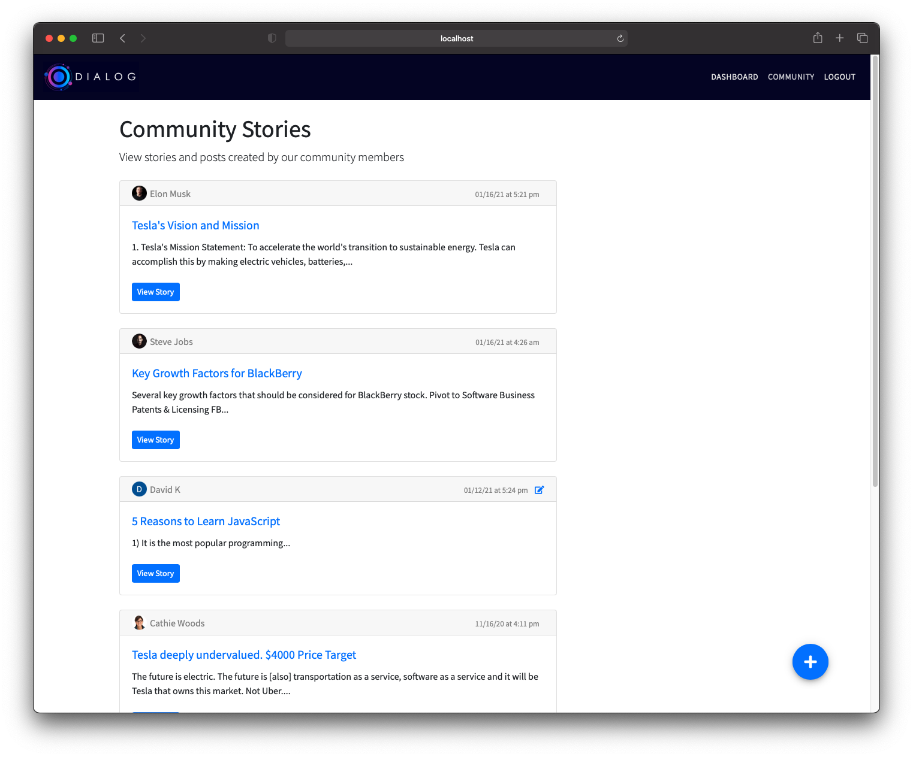

Dialog is a private online community that allows users to publish their ideas, thoughts, and stories.

This project utilizes several tools and technologies including, but not limited to:

* Node JS
* MongoDB
* Google O-Auth
* Express
* Mongoose
* Passport
* Handlebars
* Bootstrap

Project inspired by Traversy Media.

[View Live Demo](https://dialog-project.herokuapp.com/)

## 📷 Screenshots






## 🚀 Quick start
Want to download this project? Get started below or [view live demo here](https://dialog-project.herokuapp.com/)

1.  **Project Setup**

    Clone the project and install the dependencies

    ```shell
    git clone https://github.com/davidkim10/dialog-app
    cd dialog-app
    npm install
    ```
    
2.  **Add an Config ENV File**
    
    Add a config.env file to your project
    
    ```shell
    cd dialog-app/config
    touch config.env
    ```
    
    Add the following variables
    ```env
    PORT = 3000
    MONGO_URI = ENTER_YOUR_MONGO_URI
    GOOGLE_CLIENT_ID = ENTER_YOUR_GOOGLE_CLIENT_ID
    GOOGLE_CLIENT_SECRET = ENTER_YOUR_GOOGLE_CLIENT_SECRET
    ```
    
3.  **Run Project**

    ```shell
    npm start
    ```
    
    For development environment use:
    ```shell
    npm run dev
    ```

    View app on `http://localhost:3000` 
